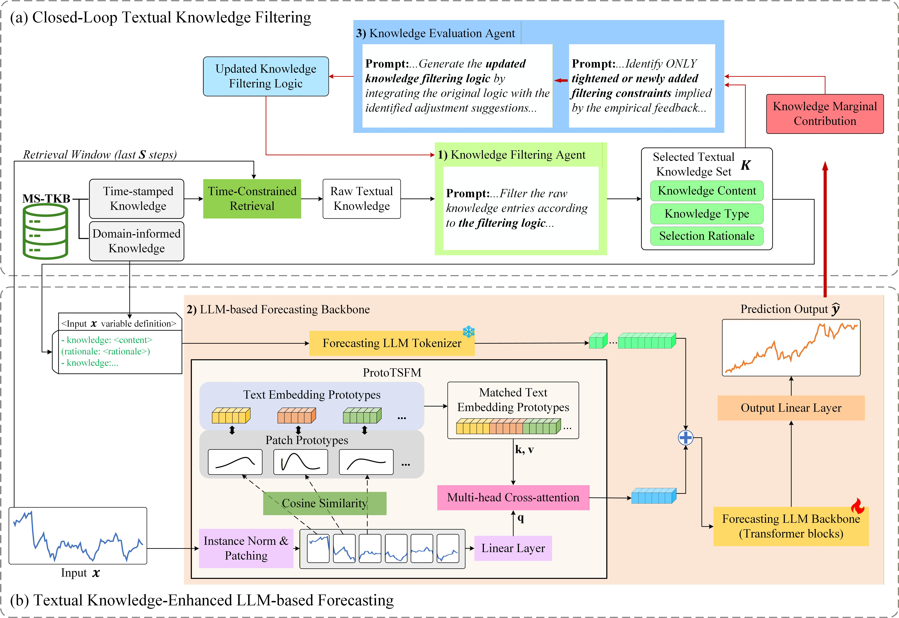

# CKFCF-MTSllm: Closed-Loop Textual Knowledge Filtering and Cross-Modal Fusion for LLM-based Multivariate Time Series Forecasting

## Overview
**CKFCF-MTSllm** is a novel textual knowledge-enhanced, LLM-based framework for **multivariate time series forecasting**, addressing the modality discrepancy between time series and text and the limitations of traditional textual knowledge filtering.

It consists of two core components:

- **Prototype-based Textual Semantic Fusion Module (ProtoTSFM)**  
  which leverages patch prototypes as semantic bridges to establish explicit cross-modal associations between time series and text and generate LLM-interpretable time series representations.

- **Closed-Loop Textual Knowledge Filtering Framework (CKFF)**  
  which employs dual LLM agents and uses knowledge marginal contributions as feedback to iteratively refine the knowledge filtering strategy, enabling predictive-value-driven knowledge selection.

Extensive experiments on four real-world benchmarks demonstrate that **CKFCF-MTSllm consistently outperforms recent state-of-the-art baselines**, including in **full-shot** and **few-shot** forecasting scenarios.

Extensive experiments on four real-world benchmarks prove that CKFCF-MTSllm surpasses recent state-of-the-art models under both full-shot and few-shot forecasting scenarios.

  

## Requirements

The code requires the following Python packages:

- torch
- numpy
- pandas
- einops
- scikit-learn
- transformers
- peft
- accelerate